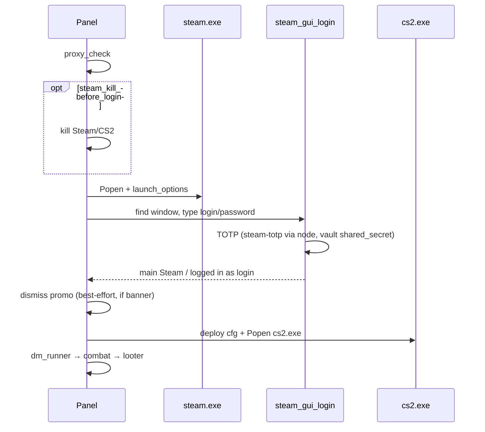
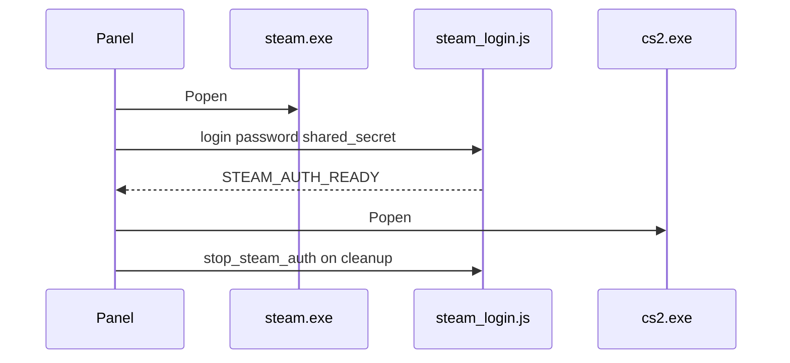

# Launcher (Steam + CS2) — B-STEAM-GUI + B-STEAM-AUTH

## Modes (`steam_login_mode`)

| Mode | Behavior |
|------|----------|
| `gui` (default, Windows farm) | Auto-login in **Steam client window** (ui_nav coords + vault TOTP) |
| `api` | Background `steam_login.js` + steam-user (B-STEAM-AUTH, looter-compatible) |
| `gui_then_api` | GUI first; on failure → API + WARN detail in log |

Config #1: **steam_login_mode** OptionMenu. Config #3: **steam_classic_login_ui** — drops `-noreactlogin` from `launch_options.txt` if React login breaks coords.

## Sequence — GUI (real farm, `test_mode: false`)

## Sequence — API (fallback)

## Secrets

| Secret | Source | Used for |
|--------|--------|----------|
| `password` | vault (`logpass` import) | GUI paste / API logOn |
| `shared_secret` | maFile | Steam Guard TOTP (`steam-totp` in `modules/launcher/totp.py`) |
| `identity_secret` | maFile | Trade confirms (looter only) |

Runtime reads **vault only** — not `data/import/logpass.txt`. Never log password, TOTP, or maFile bodies in Main log.

## GUI calibration (B-STEAM-GUI-705)

**Primary profile (ArmoryFarm):** sign-in window **client area 705×440** @ Windows DPI 100%.

| Profile | File | When loaded |
|---------|------|-------------|
| `705x440` | `resources/ui_nav/steam_login_705x440.yaml` | `\|client_w−705\|≤60` and `\|client_h−440\|≤40` → scale **1:1** |
| `1920x1080` | `resources/ui_nav/steam_login_1920x1080.yaml` | fallback + proportional scale |

- LOGIN only (not main Steam window after login).
- Fields on the **left** (~x=200); QR on the right — do not use 1920-placeholder x≈640.
- Main log / logs may show: `coords=705x440` on success (no secrets).
- On failure: `data/logs/steam_login/{login}_{ts}_{step}.png`

Recalibrate: edit yaml `clicks.*` for your machine; at **125% DPI** client size changes — re-measure `client_size(hwnd)`.

### TOTP (`totp_once.js`)

- `vendor/looter/totp_once.js` reads `shared_secret` from a **temp file** under `data/` (not argv — long base64 breaks on Windows).
- Same `steam-totp` as `looter_core.js`; requires `npm install` in `vendor/looter`.
- Code format: **5 characters** (`23456789BCDFGHJKMNPQRTVWXY`), not 6 digits.
- On failure: `steam guard TOTP: ...` (stderr tail only, no secrets).

### Mobile app push → «Enter a code instead» (B-STEAM-GUI-PUSH)

After login/password Steam may show **«Use the Steam Mobile App to confirm your sign in»** (push), not a code field.

| Step | Automation |
|------|------------|
| Push screen detected | Click `enter_code_instead` in `steam_login_705x440.yaml` (center ~352×320) |
| TOTP entry screen | `generate_steam_guard_code` → paste 5-char Steam Guard code → Enter |
| Fail | Screenshot `data/logs/steam_login/*_enter_code_miss.png` or `*_guard_timeout.png` |

Classic TOTP screen (no push): skip `enter_code_instead`, paste code directly.

**Not supported:** email Guard; tap «Confirm» on physical phone without TOTP (post-MVP: SDA confirmation API).

### Promo banner dismiss (B-STEAM-PROMO-DISMISS)

After `steam_login_ok`, before `steam_ok` / CS2:

| Scenario | Behavior |
|----------|----------|
| **main only** (no promo) | No-op in &lt;1s, `steam_ok` continues |
| **banner + main** | Detect title heuristics (`sale`, `RGG`, …) → Esc / WM_CLOSE / click `promo_close` |
| Dismiss fail but MAIN visible | WARN in log, **`steam_ok` + `cs2_ok` still run** (soft-fail) |
| LOGIN still open | Skip dismiss (login not finished) |

Coords: `resources/ui_nav/steam_main_default.yaml` (`promo_close` — top-right X on promo modal). Recalibrate on operator PC if Esc/WM_CLOSE miss.

Config: `steam_dismiss_promo` (default `true`), `steam_promo_dismiss_timeout_sec` (default `10`).

### `-noreactlogin` / classic UI

- **`steam_classic_login_ui` default `true`** — Steam starts **without** `-noreactlogin` (classic 705×440 form).
- If React login is required: set `steam_classic_login_ui: false` in Config #3 and recalibrate coords.

## API script (mode `api`)

- Path: `vendor/looter/steam_login.js`
- Deps: `npm install` in `vendor/looter`
- Stays alive after `STEAM_AUTH_READY`; `stop_steam_auth()` on cleanup

## Config (`data/config.yaml`)

| Field | Default | Meaning |
|-------|---------|---------|
| `steam_auto_login` | `true` | Auto login before `steam_ok` |
| `steam_login_mode` | `gui` | `gui` \| `api` \| `gui_then_api` |
| `steam_classic_login_ui` | `true` | Omit `-noreactlogin` (classic login 705×440) |
| `steam_login_timeout_sec` | `120` | GUI wait for main / API ready |
| `steam_kill_before_login` | `true` | `kill_all` before each session |
| `steam_dismiss_promo` | `true` | Close promo banner after login OK (best-effort) |
| `steam_promo_dismiss_timeout_sec` | `10` | Promo detect/dismiss timeout |
| `cs2_window_wait_timeout_sec` | `90` | Wait for CS2 window after Popen |
| `cs2_main_menu_wait_timeout_sec` | `120` | Soft main-menu probe wait before `cs2_ok`; timeout → unconfirmed + dm nav (not hard fail) |
| `only_launch_steam` | `false` | Skip CS2; cleanup keeps Steam |

## Events (Main log)

- `steam_login_start` → `steam_login_ok` → (promo dismiss) → `steam_ok` → **wait CS2 window** → **wait CS2 main menu** (soft 1/2 probes, artifacts) → `cs2_ok menu ready` **or** `cs2 menu unconfirmed … trying dm nav` → `dm click …` → `in_dm`
- Fail: `steam_login_failed` + `session_failed`
- `gui_then_api`: success detail may include `api fallback ok`

## Troubleshooting

| Symptom | Check |
|---------|--------|
| Push «confirm in mobile app» | Auto-click **Enter a code instead** → TOTP from vault; calibrate `enter_code_instead` in yaml if miss |
| `invalid code from steam-totp` | `cd vendor\looter && npm install`; check `totp_once.js`; Windows time sync (NTP) |
| Store visible but `logged-in state not detected` | Update to build with large MAIN detect (≥680×480); `git pull` |
| `CS2 window not found` right after `cs2_ok` | Fixed: `wait_for_cs2_hwnd` before `cs2_ok`; increase `cs2_window_wait_timeout_sec` |
| CS2 in menu but no DM / cursor still | Main log: `dm click …` lines? Calibrate `coords_360x270.yaml` (Panorama RU); strict `in_dm` |
| `CS2 main menu not detected` | Launcher no longer hard-fails: `cs2_ok` unconfirmed + dm nav; artifacts under `data/artifacts/{session_id}/`; calibrate `main_menu` in `coords_360x270.yaml` |
| Steam opens but no typing | Calibrate `steam_login_705x440.yaml`; `steam_classic_login_ui: true` |
| Guard timeout | Windows time sync (NTP); valid `shared_secret` in maFile |
| `email Steam Guard not supported` | Mobile authenticator maFile only (post-MVP: email flow) |
| `node_modules missing` (api / TOTP) | `cd vendor\looter && npm install` |
| `account not in vault` | Import from logpass + maFile |
| Wrong account in Steam | `steam_kill_before_login: true` or calibrate logout coords |
| Manual login | `steam_auto_login: false` |
| Only log OK, no GUI login | `steam_login_mode: api` — switch to `gui` |
| Promo «RGG Studio Sale» blocks view | Auto-dismiss after login; calibrate `steam_main_default.yaml` if needed |
| `promo dismiss failed` in log | Soft-fail — CS2 still starts; check Esc/WM_CLOSE or coords |

## Sim / tests

- `STEAM_GUI_LOGIN_SIM=1` — instant GUI login OK (pytest)
- `STEAM_LOGIN_SIM=1` — instant API auth OK (pytest)

## Compliance

Automated Steam login may violate [Steam SSA](https://store.steampowered.com/subscriber_agreement/). Operators accept operational/legal risk.
